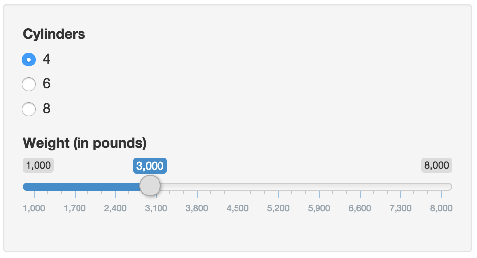

## Why Smart Car Shopping Matters

Average car ownership in the US has been rising steadily in recent years.  In 
2002, car ownership averaged just under 5 years, however due to the recession 
and manufacturing/technology advances, in 2015 consumers are keeping their cars 
much longer - roughly 8 years.

Due to this increase, we must be more concious when selecting our vehicles.  Fuel 
consumption should be top of mind during purchase, both because of the carbon 
emissions AND the ever increase cost of fuel.

We need to plan before effectively for the future, which is where this app comes in.

--- .class #id 

## A Simply Guage of Fuel Economy

This Shiny app uses Data Science to offer predictive powers, allowing you to 
cross-check the vehicle's stated fuel performance simply by entering the number 
of cylinders and the vehicles weight (in pounds).



--- .class #id

## The Power Behind Prediction

Through multivariate analysis, we've found a strong correlation between the 
number of cylinders and weight relating to a car's fuel performance.

```{r warning=FALSE, echo=FALSE, fig.width=12, fig.align='center'}
data(mtcars)

par(mfrow=c(1,2))
# Plot shows a clear negative relationship between cyl and mpg
with(mtcars, plot(cyl, mpg, xlab="cylinders", ylab="mpg", 
                  main="Cylinder Impact on MPG"))
abline(lm(mpg ~ cyl, mtcars), lwd = 2)

# Weight: highly correlated negative slope.
with(mtcars, plot(wt, mpg, xlab="weight (tons)", ylab="mpg", 
                  main="Weight Impact o MPG"))
abline(lm(mpg ~ wt, mtcars), lwd = 2)
```

--- .class #id

## Using the App

URL: [https://shauncollett.shinyapps.io/CourseProject/](https://shauncollett.shinyapps.io/CourseProject/)

To use the app, simply enter the number of cylinders and weight from the car's 
specs to see the predicted fuel efficiency, as well as a 95% confidence interval 
if you're placing a big bet on accuracy.

### Ideas to Improve

I recognize this is a very bare bones app, providing information already available 
on the car's spec sheet, however I can see several areas where this could be extended, 
time permitting:

1. Using fuel consumption to calculate "carbon footprint" over the average lifetime 
ownership of the car.  This could be benchmarked against other cars.
2. Integrate a gas price prediction algorithm to predict total cost of gas over the
lifetime of owning this car.  This is a more meaningful number for people 
to wrap their heads around than simply MPG.

